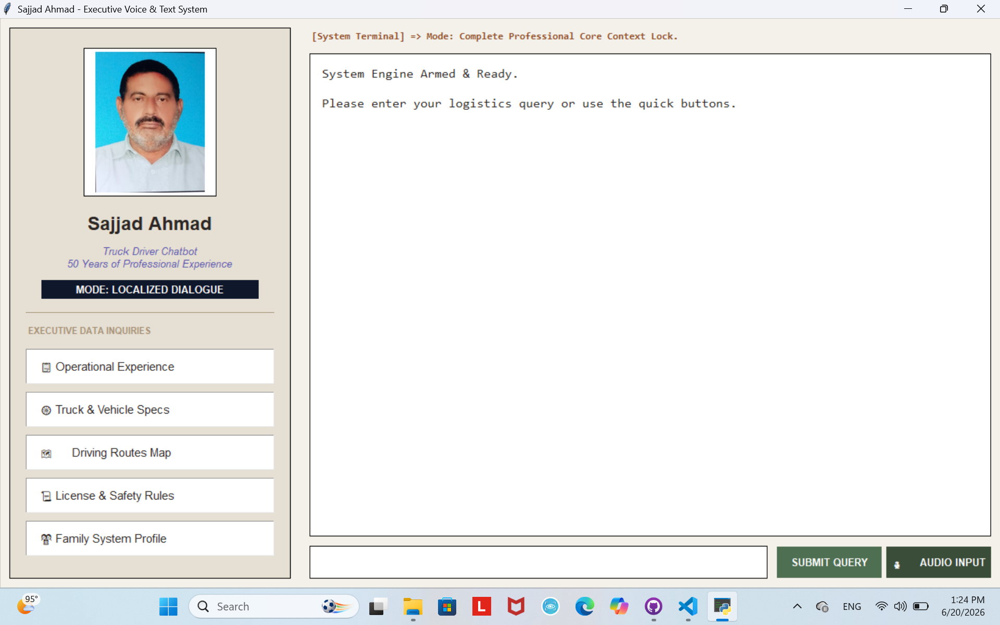

# Truck Driver Profile Chatbot

## Project Overview
This project is an AI-powered desktop application designed as a professional assistant for truck drivers. It provides an offline, secure, and easy-to-use interface to access career records, safety protocols, and personal information.

## System Components
* **main.py**: The main application entry point.
* **ui.py**: A professional graphical interface built with Tkinter.
* **logic.py**: The core engine that processes queries using Regular Expressions.
* **data.py**: The database module for storing driver profiles.
* **requirements.txt**: List of necessary dependencies.

## Key Features
* **Offline Operation**: Runs locally without requiring an internet connection.
* **Voice Assistance**: Integrated with pyttsx3 for audible responses.
* **User-Friendly UI**: A clean dashboard for quick data retrieval.
* **Smart Logic**: Efficient pattern matching for accurate information delivery.

## Interface Preview

